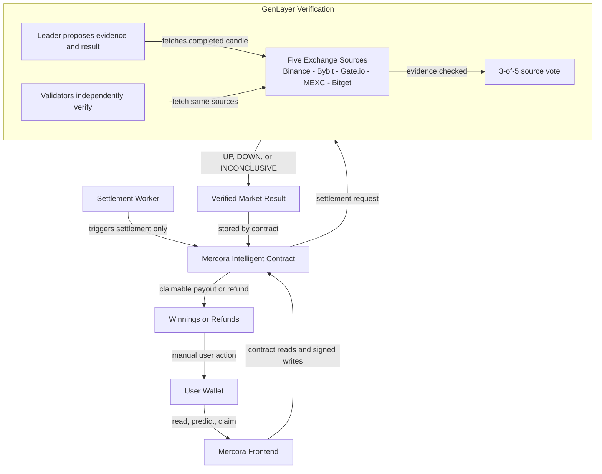

# Mercora

GenLayer-powered one-hour crypto prediction markets verified across five exchanges.

Mercora lets users predict whether BTC, ETH, BNB, or SOL will finish UP or DOWN against USDT during one exact UTC hour. Users stake GEN before the candle begins, and the Intelligent Contract applies the result after GenLayer verifies exchange evidence.

`GenLayer Bradbury` | `BTC / ETH / BNB / SOL` | `5 exchange sources` | `3-of-5 verification` | `one-hour markets`

## What Mercora Is

Mercora offers one-hour UP/DOWN markets for BTC, ETH, BNB, and SOL against USDT. Users stake GEN before the selected candle begins.

The result is determined from the completed one-hour candle. GenLayer verifies evidence from Binance, Bybit, Gate.io, MEXC, and Bitget, and at least three matching directional votes are required.

## Project Links

| Resource | Destination |
| --- | --- |
| Live App | [Open Mercora](https://mercora-omega.vercel.app/) |
| Documentation | [Read the documentation](https://mercora-omega.vercel.app/docs) |
| How It Works | [View the product flow](https://mercora-omega.vercel.app/how-it-works) |
| Network Explorer | [Bradbury Explorer](https://explorer-bradbury.genlayer.com/) |
| Worker Status | [Settlement Worker health](https://mercora-settlement-worker.jxson-parametrix.workers.dev/health) |

**Production contract:**

`0x0A3Fcc4671b6fF0BffBCDab3B744CFf6d5c7ED05`

## Why Mercora

- Market rules are enforced by the Intelligent Contract, not by frontend calculations.
- Settlement uses five exchange sources instead of one price feed.
- GenLayer lets a leader propose evidence while validators independently verify it.
- The Settlement Worker triggers due markets, but it cannot submit prices or choose UP/DOWN.
- Winnings and refunds are claimed by users through contract transactions.

## Vision

Mercora was built to show that prediction markets can be settled without relying on a single market operator, a manually supplied outcome, or one authoritative price source. Crypto markets trade continuously, but many prediction products still leave users asking who decides the result, which venue counts, and what happens when sources disagree.

Mercora keeps the first market type intentionally narrow: one supported crypto asset, one exact UTC hour, one UP or DOWN rule, and five independent exchange sources. A market resolves UP only when the completed candle closes above its opening price; otherwise a valid source votes DOWN.

Five sources reduce dependence on any single exchange, and the three-of-five threshold gives the contract a clear rule when one or two sources are unavailable or disagree. If neither side reaches three matching directions, the market becomes inconclusive and participants can claim refunds instead of accepting a forced result.

GenLayer provides the verification layer for that evidence. A leader proposes the source evidence and result, validators independently check the same sources, and the Intelligent Contract applies the verified outcome to stakes, claims, and refunds.

The Settlement Worker and frontend have limited roles by design. The Worker only triggers settlement for due markets, while the frontend presents contract data and sends signed user requests. The longer-term principle is a prediction market where settlement logic is understandable before participation, based on public evidence, independently checked, and applied consistently by the contract.

## How It Works

1. Authorized creator opens a BTC, ETH, BNB, or SOL market for a future UTC hour.
2. Users choose UP or DOWN and stake GEN.
3. Betting closes when the candle begins.
4. The one-hour candle completes.
5. The Settlement Worker calls settlement after the required delay.
6. GenLayer checks five exchanges and verifies the proposed result.
7. Winners claim, or participants refund if the result is cancelled or inconclusive.

The frontend does not choose the outcome. The Worker does not submit prices. The Worker only triggers settlement, and the contract fetches and evaluates evidence through GenLayer verification.

## UI Tour

### 1. Browse Markets

Users can view active, upcoming, and completed one-hour markets with timing, status, pool totals, and directional percentages. Public markets load without requiring a wallet connection.

<!-- Screenshot required: Markets page -->

### 2. Make a Prediction

The market detail page shows the exact UTC candle window, UP and DOWN pools, user stake limits, market status, and the contract-backed prediction action. Users choose a direction and submit a signed GEN stake transaction from their connected wallet.

<!-- Screenshot required: Market detail and prediction page -->

### 3. Track Positions and Claims

Portfolio shows markets a connected user participated in, including their position, result, claimable winnings, or refundable stake. Claim and refund actions are shown from contract-backed user state.

<!-- Screenshot required: Portfolio page -->

### 4. Understand Settlement

The Documentation and How It Works pages explain the five-source model, three-vote requirement, Worker role, contract permissions, claims, and refunds. These pages give users the settlement model without turning the app into an API reference.

<!-- Screenshot required: Documentation or How It Works page -->

## Market Rules

| Rule | Current behavior |
| --- | --- |
| Supported assets | BTC, ETH, BNB, SOL |
| Quote asset | USDT |
| Market period | One exact UTC hour, 3,600 seconds |
| Market question | Generated by the contract from asset and candle time |
| Creation lead time | At least 30 minutes before candle start |
| Minimum stake | 1 GEN |
| Maximum stake | 10 GEN cumulative per wallet per market |
| Additional stake | Allowed on the same side until the wallet reaches 10 GEN |
| Direction lock | One wallet cannot bet both UP and DOWN in the same market |
| Betting close | Candle start |
| Market creation | Owner or configured market operator only |

Arbitrary user-created questions are not supported. The contract derives the official pair, question, candle start, candle end, betting close time, and settlement time.

## Settlement and Verification

Mercora checks these five configured sources for the exact completed one-hour candle:

- Binance
- Bybit
- Gate.io
- MEXC
- Bitget

For each valid source:

```text
close > open  -> UP
close <= open -> DOWN
```

Invalid, unavailable, malformed, oversized, failed, or wrong-timestamp evidence does not count as an UP or DOWN vote.

Settlement rule:

```text
3 or more UP votes   -> UP
3 or more DOWN votes -> DOWN
No side reaches 3    -> INCONCLUSIVE
```

Cancelled markets are handled separately. The current contract cancels settlement when the market is empty or only one side has a pool. Cancelled and inconclusive markets allow participating users to claim refunds.

The contract settlement delay is 120 seconds after the candle closes. The Worker adds a 180-second grace period before submission, so normal automated settlement is approximately five minutes after the candle ends, subject to network and RPC timing.

## Architecture



The frontend submits reads and signed user transactions. The Worker only calls settlement for due markets. GenLayer verifies the exchange evidence, and the Intelligent Contract stores the final state used for claims and refunds.

## Trust Model

| Component | What it does | What it cannot do |
| --- | --- | --- |
| Frontend | Displays markets and sends user transactions | Cannot choose outcomes |
| Worker | Finds due markets and calls settlement | Cannot submit prices or select UP/DOWN |
| Owner/operator | Creates markets and triggers settlement | Cannot override verified source result |
| Exchanges | Provide candle evidence | One exchange cannot decide alone |
| Leader | Proposes result from evidence | Cannot finalize without validator agreement |
| Validators | Independently verify evidence | Cannot change user stakes |
| Contract | Stores state and applies rules | Does not trust frontend balances |

## Supported Assets and Limits

| Item | Value |
| --- | --- |
| Assets | BTC, ETH, BNB, SOL |
| Pairs | BTC/USDT, ETH/USDT, BNB/USDT, SOL/USDT |
| Period | One exact UTC hour, 3,600 seconds |
| Minimum stake | 1 GEN |
| Maximum cumulative stake | 10 GEN per wallet per market |
| Required source agreement | 3 matching directions out of 5 configured sources |
| Outcomes | UP, DOWN, INCONCLUSIVE, CANCELLED |

## Pari-Mutuel Payouts

Mercora uses shared pools. The displayed UP/DOWN percentages reflect pool composition, not fixed odds.

```text
UP pool: 6 GEN
DOWN pool: 4 GEN
Total pool: 10 GEN

A user who supplied half of the winning UP pool receives half of the full 10 GEN pool.
```

Payouts depend on final pool totals. Winning wallets claim manually. Losing positions receive no payout. The current contract does not define a protocol fee.

## Technical Stack

- GenLayer Intelligent Contract
- Python contract source
- React and TanStack frontend
- TypeScript
- Wagmi, RainbowKit, and injected browser wallet providers
- Vercel frontend hosting
- Cloudflare Worker and Durable Object settlement coordination
- Binance, Bybit, Gate.io, MEXC, and Bitget candle APIs

## Contract Interface

[View the contract source](contract/MercoraMarket.py).

<details>
<summary>Write methods</summary>

- `set_market_operator` - Owner sets the authorized market operator.
- `create_market` - Owner or operator creates a supported future UTC-hour market.
- `place_bet` - User stakes GEN on UP or DOWN.
- `settle_market` - Owner or operator triggers contract-controlled settlement.
- `claim_winnings` - Winning participant claims the calculated pari-mutuel payout.
- `claim_refund` - Participant claims the original stake for a cancelled or inconclusive market.

</details>

<details>
<summary>Read methods</summary>

- `get_market` - Returns the full market record and display status.
- `market_exists` - Checks whether a market ID exists.
- `get_market_count` - Returns the number of created markets.
- `get_market_display_status` - Returns the time-aware market status.
- `is_market_ready_for_settlement` - Checks whether settlement can be triggered.
- `get_due_market_ids` - Lists open markets ready for settlement.
- `get_active_market_ids` - Lists active market IDs.
- `get_market_ids` - Lists market IDs from newest to oldest.
- `get_completed_market_ids` - Lists settled, cancelled, or inconclusive market IDs.
- `get_market_probabilities_bps` - Returns UP and DOWN pool percentages in basis points.
- `get_user_position` - Returns a wallet's stake and chosen side.
- `get_user_market_ids` - Lists markets where a wallet participated.
- `get_user_market_ids_page` - Paginates a wallet's participated market IDs.
- `get_user_market_status` - Returns position, result, claim, and refund state.
- `get_claimable_amount` - Returns a wallet's unclaimed winnings.
- `get_refundable_amount` - Returns a wallet's unclaimed refund.
- `get_market_id_by_key` - Finds a market by asset and UTC candle start.
- `validate_market_creation` - Checks whether a proposed market can be created.
- `get_market_configuration` - Returns configured assets, limits, sources, and timing.
- `get_protocol_stats` - Returns owner, operator, counts, totals, and configuration.

</details>

## Repository Structure

```text
mercora/
|-- contract/
|-- cron/
|-- frontend/
|-- config/
|-- docs/
|-- tests/
`-- README.md
```

- [MercoraMarket.py](contract/MercoraMarket.py) - GenLayer Intelligent Contract source.
- [cron](cron/) - Cloudflare Settlement Worker and settlement coordination tests.
- [frontend](frontend/) - React/TanStack app, wallet integration, contract reads, and UI.
- `config/` - ABI and deployment configuration artifacts.
- `docs/` - Supporting design, deployment, and frontend-integration notes.
- `tests/` - Local contract tests.

Generated directories such as `node_modules`, build output, caches, and Worker dry-run output are intentionally omitted.

## Running Locally

### Frontend

```sh
cd frontend
bun install
bun run dev
```

Useful frontend validation commands:

```sh
bun run lint
bun run test
bunx tsc --noEmit
bun run build
```

The frontend can use the production contract default from `frontend/src/config/mercora.ts`. Set `VITE_MERCORA_CONTRACT_ADDRESS` only when you need a local or alternate contract.

### Settlement Worker

```sh
cd cron
npm install
npm run dev
npm run lint
npm test
npm run typecheck
npm run build
```

`npm run build` is a Wrangler dry run. Worker deployment is a separate production action.

Worker configuration names include:

- `GENLAYER_NETWORK`
- `GENLAYER_RPC`
- `MERCORA_CONTRACT_ADDRESS`
- `MERCORA_OPERATOR_ADDRESS`
- `MERCORA_EXTRA_SETTLEMENT_GRACE_SECONDS`
- `GAS_MARGIN_PERCENT`
- `MERCORA_OPERATOR_PRIVATE_KEY`
- `MERCORA_ADMIN_TOKEN`

Private keys and admin tokens belong in platform secret storage, not `.env` or `.dev.vars` files.

### Contract Tests

```sh
python -m pip install -r requirements-dev.txt
python -m pytest tests -q
```

These local tests avoid production contract writes.

## Testing

Current frontend validation commands:

```sh
cd frontend
bun run lint
bun run test
bunx tsc --noEmit
bun run build
```

The current frontend suite contains 70 passing tests at the time of this README update. This is separate from coverage.

## Production Deployment

- The frontend deploys from GitHub to Vercel.
- The Settlement Worker deploys separately to Cloudflare Workers and runs on a one-minute schedule.
- The Intelligent Contract from [MercoraMarket.py](contract/MercoraMarket.py) is deployed on GenLayer Bradbury Testnet at `0x0A3Fcc4671b6fF0BffBCDab3B744CFf6d5c7ED05`.
- Worker secrets remain in Cloudflare.
- The frontend does not hold settlement secrets and does not choose settlement outcomes.
- The Worker signs only settlement trigger transactions from the configured operator account.

## Current Limitations

- Bradbury is a testnet.
- Supported assets are currently limited to BTC, ETH, BNB, and SOL.
- Markets are fixed to one-hour UTC candles.
- Market creation is permissioned to the owner or configured market operator.
- Settlement depends on availability and correctness of the configured exchange sources.
- Wallet compatibility can vary by injected provider.
- Rabby is the browser wallet path confirmed end-to-end; MetaMask is not listed as fully supported on Bradbury while current RPC request-ID behavior remains unresolved.
