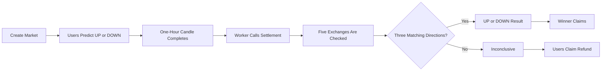
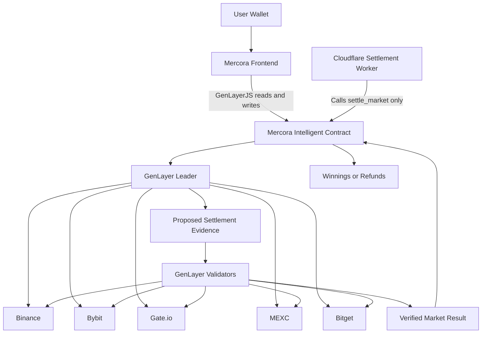

# Mercora

> Mercora is a GenLayer-powered one-hour crypto prediction market where outcomes are verified from five exchanges and require three matching source directions.

Mercora lets users predict whether BTC, ETH, BNB, or SOL will finish UP or DOWN during one exact UTC hour. Users stake GEN before the hour begins. The Intelligent Contract verifies the completed candle from multiple exchanges, stores the result, and controls winnings or refunds.

## Production Deployment

| Resource | Details |
| --- | --- |
| Live App | [https://mercora-omega.vercel.app/](https://mercora-omega.vercel.app/) |
| Intelligent Contract | `0x0A3Fcc4671b6fF0BffBCDab3B744CFf6d5c7ED05` |
| Network | GenLayer Bradbury Testnet |
| Contract Source | [`contract/MercoraMarket.py`](contract/MercoraMarket.py) |
| Settlement Worker | [https://mercora-settlement-worker.jxson-parametrix.workers.dev](https://mercora-settlement-worker.jxson-parametrix.workers.dev) |

No GenLayer Bradbury explorer link is included because the repository does not confirm the correct explorer URL format.

## The Problem

Prediction markets require a trusted way to determine what happened in the real world.

A traditional crypto direction market may depend on one exchange, a backend, an administrator, or an off-chain result submitted by an operator.

> If one party can provide the price or choose UP or DOWN, that party can influence who wins.

Mercora is designed around reducing that operator trust. The app can display results, and the Worker can trigger settlement, but neither one decides the market outcome.

## The Solution

Mercora uses a GenLayer Intelligent Contract as the authority for market creation, staking, settlement, evidence, winnings, losses, refunds, and claims.

Users stake GEN into shared UP and DOWN pools. The contract fetches five exchange candles during settlement. Winners claim from the pool, while cancelled or inconclusive markets allow refunds.

The frontend does not decide outcomes. The cron Worker does not submit prices. The operator does not select the winner. The contract and GenLayer validators verify the evidence.

| Setting | Value |
| --- | --- |
| Assets | BTC, ETH, BNB, SOL |
| Quote asset | USDT |
| Market period | One exact UTC hour |
| Positions | UP or DOWN |
| Stake range | 1-10 GEN per wallet per market |
| Settlement sources | Binance, Bybit, Gate.io, MEXC, Bitget |
| Required agreement | 3 matching directions |
| Contract safety delay | 120 seconds |
| Worker additional grace | 180 seconds |

## How It Works

1. An authorized creator opens a market for a supported asset and future UTC hour.
2. Users choose UP or DOWN and stake GEN before the candle begins.
3. Betting closes when the one-hour candle starts.
4. The settlement Worker checks the contract every minute and triggers due settlements.
5. The GenLayer leader and validators independently fetch the five exchange sources.
6. Three matching directions produce UP or DOWN; otherwise, the market becomes inconclusive and users can claim refunds.



## Key Innovations

### Five-source settlement

Mercora checks Binance, Bybit, Gate.io, MEXC, and Bitget instead of trusting one source. The market result requires three matching source directions.

### Validator-refetched evidence

The leader proposes settlement evidence, but validators independently fetch and verify the same source set. Settlement is accepted only when GenLayer consensus verifies the proposal.

### Operator cannot choose the winner

The Worker and authorized operator can trigger settlement, but cannot submit the outcome or prices. `settle_market(market_id)` has no result argument.

### Contract-generated market rules

The contract derives the official question, pair, candle period, betting close time, and settlement time. The frontend displays these values from contract reads.

### Safe inconclusive outcome

When neither UP nor DOWN receives three matching votes, the contract does not force a result. The market becomes `INCONCLUSIVE`, and participants can claim refunds.

### Automatic contract refresh

The frontend refreshes unfinished contract state in the background so results, winnings, losses, and refunds appear without a browser reload. It also keeps the last successful data visible during temporary read failures.

## Technical Pillars

| Pillar | Responsibility |
| --- | --- |
| Mercora Intelligent Contract | Creates markets, stores stakes, fetches and verifies evidence, applies settlement rules, and calculates claims and refunds. |
| Five Exchange APIs | Provide completed one-hour BTC/USDT, ETH/USDT, BNB/USDT, and SOL/USDT spot candle evidence. |
| GenLayer Consensus | Lets a leader propose evidence while validators independently refetch and verify the settlement. |
| Settlement Worker | Discovers due markets and calls `settle_market`; it cannot submit prices or choose the outcome. |
| Mercora Frontend | Lets users browse markets, place predictions, track positions, receive notifications, and claim winnings or refunds from contract-backed state. |
| GenLayer Bradbury Testnet | Hosts the production Mercora Intelligent Contract and processes contract reads and writes. |

## System Architecture



The Worker appears in the system as an automation trigger. The Intelligent Contract and GenLayer consensus are the source of truth for settlement.

## Production Contract Flow

### Market creation

```text
Creator selects asset and UTC hour
-> contract checks supported asset
-> contract checks exact hour alignment
-> contract enforces 30-minute lead time
-> contract rejects duplicates
-> market becomes OPEN
```

The contract derives the market pair, question, UTC candle period, betting close, candle end, and settlement time from the chosen asset and hour.

### Prediction

```text
User chooses UP or DOWN
-> sends 1-10 GEN
-> contract checks betting is open
-> contract prevents one wallet from using both sides
-> stake enters the selected pool
```

UP wins when the completed candle closes strictly higher than it opened. DOWN wins when the close is equal to or lower than the open.

### Settlement

```text
Candle completes
-> contract safety delay passes
-> Worker waits its additional grace period
-> Worker calls settle_market
-> leader fetches five exchanges
-> validators independently refetch
-> three matching votes determine the outcome
```

The Worker submits only after both the contract delay and its additional grace period have passed.

### Claim or refund

```text
Winner
-> claim_winnings
-> contract calculates pari-mutuel payout
-> GEN transferred

Cancelled or inconclusive participant
-> claim_refund
-> original stake returned
```

Claim and refund actions are based on contract reads, not frontend guesses.

## GenLayer Settlement Flow

GenLayer is used because the contract needs to verify external exchange data without trusting one backend or operator.

The leader fetches five completed exchange candles and proposes a result. Validators independently fetch the same sources and verify whether the evidence supports that proposal.

1. The leader fetches all five completed one-hour candles.
2. Each source becomes UP, DOWN, or UNAVAILABLE.
3. The leader counts the votes and proposes a result.
4. Validators inspect the proposal.
5. Validators independently fetch the same five sources.
6. Validators compare their own evidence with the proposed result.
7. GenLayer consensus accepts or rejects the settlement.

Settlement rule:

```text
3 or more UP votes   -> UP
3 or more DOWN votes -> DOWN
No three-vote result -> INCONCLUSIVE
```

Example accepted UP result:

```text
Binance: UP
Bybit: UP
Gate.io: UP
MEXC: DOWN
Bitget: UNAVAILABLE

UP votes: 3
DOWN votes: 1
Unavailable: 1

Final outcome: UP
```

Example inconclusive result:

```text
UP votes: 2
DOWN votes: 2
Unavailable: 1

Final outcome: INCONCLUSIVE
```

The cron starts settlement, but it does not choose the result.

## End-to-End Production Proof

The production evidence below shows a completed Worker-driven settlement flow. No market ID is listed because a market ID was not verified from the existing repository evidence.

| Item | Value |
| --- | --- |
| Production contract | `0x0A3Fcc4671b6fF0BffBCDab3B744CFf6d5c7ED05` |
| Market ID | Not listed; not verified from existing evidence |
| Worker schedule | Every minute |
| Worker final state | `COMPLETED` |
| Attempt count | `1` |
| Duplicate submission | `None` |
| Submission/EVM hash | `0xd32307ed704ca75ff3ff3009ff089d5d20cf570d910b5b515413b1dbd85e67bb` |
| GenLayer transaction ID | `0x6f1917751f01d8d5054495b5f630beef1ab4a463a4f3d547af8b814d56131b2f` |
| Latest Worker version | `c4dcac2f-909a-464c-912e-629b10db5191` |

```text
Due market discovered
-> one settlement submitted
-> transaction reached ACCEPTED
-> execution was verified
-> final market state was verified
-> job marked COMPLETED
```

The existing persisted job recovered correctly. No second transaction was submitted. Both original transaction identifiers were preserved. The attempt count remained one.

<!-- Add screenshot: Worker /status showing COMPLETED -->
<!-- Add screenshot: GenLayer explorer showing ACCEPTED -->
<!-- Add screenshot: final market evidence in the UI -->

## UI Tour

### Markets page

Browse one-hour crypto markets, their status, timing, pools, and probabilities. The page reads market ID pages, market records, and probability data from the contract-backed service boundary.

<!-- Add screenshot: Markets page -->

### Market detail

Review the exact UTC candle period, choose UP or DOWN, and submit a GEN-backed prediction. The detail page reads the market, probabilities, connected-user status, claimable amount, and refundable amount.

<!-- Add screenshot: Market detail page -->

### Waiting for result

After betting closes, Mercora continues reading contract state while the Worker handles settlement. Waiting, ready, settled, cancelled, and inconclusive states refresh without requiring a browser reload.

<!-- Add screenshot: Waiting for result state -->

### Exchange evidence

View the five source results, opening and closing prices, source direction, availability, and vote count after settlement evidence exists on the market.

<!-- Add screenshot: Exchange evidence table -->

### Portfolio

Track active, waiting, won, lost, claimable, refundable, claimed, and refunded positions. Portfolio state comes from `get_user_market_ids_page`, `get_user_market_status`, claimable reads, and refundable reads.

<!-- Add screenshot: Portfolio page -->

### Admin market creation

Authorized creators select a supported asset and future UTC hour while the contract validates the market before submission. The UI uses `validate_market_creation`, duplicate lookup, and owner/operator authorization reads, but the contract repeats the checks.

<!-- Add screenshot: Admin market creation -->

## Trust Model

| Component | Responsibility | Cannot Do |
| --- | --- | --- |
| Frontend | User experience, contract reads, wallet connection, transaction submission, and status display. | Choose the final result, invent claimable amounts, or override contract state. |
| Cloudflare Worker | Discover due markets, use Durable Object job state, and call `settle_market`. | Submit prices, submit exchange evidence, or choose UP/DOWN. |
| Owner/operator | Create supported markets and authorize settlement calls. | Override the contract's source vote result or force a winner. |
| Exchange providers | Provide completed one-hour candle evidence. | One source alone cannot determine the result. |
| GenLayer leader | Fetch source evidence and propose a settlement result. | Finalize state without validator consensus. |
| GenLayer validators | Independently refetch evidence and verify the proposal. | Change stakes, claims, refunds, or market rules directly. |
| Intelligent Contract | Enforce rules, hold stakes, verify evidence, settle markets, and pay claims/refunds. | Depend on frontend-only guesses for financial state. |

## Safety and Failure Behavior

| Case | Current behavior |
| --- | --- |
| Empty market | Settlement finishes as `CANCELLED`; no winner is selected. |
| One-sided market | Settlement finishes as `CANCELLED`; participants can claim refunds. |
| Fewer than three matching votes | Final outcome is `INCONCLUSIVE`; participants can claim refunds. |
| Unavailable provider | That source is marked `UNAVAILABLE`; settlement can continue if three matching valid votes remain. |
| Malformed provider response | That source is marked `UNAVAILABLE` with a provider failure reason. |
| Wrong candle timestamp | That source is unavailable because it does not prove the exact expected candle. |
| Early settlement | Rejected until the contract settlement safety delay has passed. |
| Unauthorized settlement | Rejected unless the caller is the owner or configured market operator. |
| Duplicate market | Rejected through market-key validation. |
| Duplicate claim | Rejected after a winnings claim or refund has already been recorded. |
| User betting both directions | Rejected; one wallet cannot use both sides in the same market. |
| Temporary frontend read failure | Last successful data remains visible and the frontend retries. |
| Ambiguous Worker broadcast | Tracked for attention and reconciled; it is not blindly repeated. |
| Duplicate Worker submission prevention | Durable Object job state and one active settlement limit prevent repeated active submissions. |

## Contract Interface

Write methods:

| Method | Purpose |
| --- | --- |
| `set_market_operator` | Owner sets the authorized market operator address. |
| `create_market` | Owner or operator creates a supported future UTC-hour market. |
| `place_bet` | User stakes GEN on UP or DOWN. |
| `settle_market` | Owner or operator triggers contract-controlled settlement. |
| `claim_winnings` | Winner claims the calculated pari-mutuel payout. |
| `claim_refund` | Participant claims the original stake for a cancelled or inconclusive market. |

Important read methods:

| Method | Purpose |
| --- | --- |
| `get_market` | Returns the full market record, including settlement evidence. |
| `market_exists` | Checks whether a market ID exists. |
| `get_market_count` | Returns total market count. |
| `get_market_display_status` | Returns display status such as `CLOSED` or `READY_FOR_SETTLEMENT`. |
| `is_market_ready_for_settlement` | Checks whether a market can be settled. |
| `get_due_market_ids` | Returns settlement-ready market IDs with pagination. |
| `get_active_market_ids` | Returns active market IDs with pagination. |
| `get_market_ids` | Returns global market IDs with pagination. |
| `get_completed_market_ids` | Returns settled, inconclusive, and cancelled market IDs. |
| `get_market_probabilities_bps` | Returns UP and DOWN pool percentages in basis points. |
| `get_user_position` | Returns a user's stake direction, stake amounts, and claim state. |
| `get_user_market_ids` | Returns the user's market IDs up to the contract view limit. |
| `get_user_market_ids_page` | Returns paginated user market IDs. |
| `get_user_market_status` | Returns user result, claimable amount, refundable amount, and participation status. |
| `get_claimable_amount` | Returns current claimable winnings for a user. |
| `get_refundable_amount` | Returns current refundable amount for a user. |
| `get_market_id_by_key` | Looks up an existing market by asset and candle start. |
| `validate_market_creation` | Validates asset, hour alignment, lead time, and duplicates. |
| `get_market_configuration` | Returns supported assets, timing, stake limits, providers, and vote threshold. |
| `get_protocol_stats` | Returns owner, market operator, market counts, and aggregate amounts. |

## Repository Structure

```text
mercora/
|-- contract/
|   `-- MercoraMarket.py
|-- frontend/
|-- cron/
|-- tests/
|-- config/
|-- docs/
|-- README.md
|-- SECURITY.md
|-- requirements-dev.txt
`-- .gitignore
```

Major folders:

- `contract/`: production GenLayer Intelligent Contract source.
- `frontend/`: Mercora web application, routes, wallet integration, contract reads/writes, notifications, and UI state.
- `cron/`: Cloudflare Worker, Durable Object store, settlement engine, GenLayer reader/writer, and Worker tests.
- `tests/`: local contract tests for financial behavior, settlement, provider adapters, permissions, listings, and timing.
- `config/`: repository configuration and ABI artifacts.
- `docs/`: supporting project documentation.

## Testing

```text
Contract tests: 122
Frontend tests: 54
Cron Worker tests: 43
```

The automated tests are local/project tests. They are separate from the production settlement proof above.

Contract tests cover:

- financial behavior;
- listing and pagination;
- provider adapters;
- settlement;
- settlement permissions;
- time and market specification rules.

Frontend tests cover:

- contract integration;
- result mapping;
- winning, losing, claim, and refund states;
- background polling;
- focus and reconnect refresh;
- post-write invalidation;
- notification stability.

Cron Worker tests cover:

- settlement discovery;
- lease behavior;
- retries;
- duplicate prevention;
- transaction state handling;
- ACCEPTED completion;
- persisted job recovery.

## Deployment

### Frontend

- Deployment platform: Vercel.
- Project root directory: `frontend`.
- Build command: `bun run build`.
- Live app: see the Production Deployment table.
- Required public environment variable:

```env
VITE_MERCORA_CONTRACT_ADDRESS=0x0A3Fcc4671b6fF0BffBCDab3B744CFf6d5c7ED05
```

### Settlement Worker

- Platform: Cloudflare Workers.
- Source directory: `cron`.
- State: Durable Object job storage.
- Submission policy: one active settlement at a time.
- Build/dry-run command: `npm run build`.
- Schedule: every minute.
- Worker URL: see the Production Deployment table.
- Required secret names only:

```env
MERCORA_OPERATOR_PRIVATE_KEY=
MERCORA_ADMIN_TOKEN=
```

Do not commit secret values.

### Contract

- Network: GenLayer Bradbury Testnet.
- Source path: `contract/MercoraMarket.py`.
- Market operator: `0xb88be5f8ed476abc8fb5e6c47b12032f075162b3`.

## Local Development

Frontend commands use Bun because `frontend/package.json` defines Bun-oriented test and lockfile usage:

```sh
cd frontend
bun install
bun run dev
bun run lint
bun run test
./node_modules/.bin/tsc --noEmit
bun run build
```

Cron commands use npm because `cron/package.json` and `cron/package-lock.json` are present:

```sh
cd cron
npm install
npm run lint
npm test
npm run typecheck
npm run build
```

Contract tests use the Python dependencies in `requirements-dev.txt`:

```sh
python -m pip install -r requirements-dev.txt
python -m pytest tests -q
```

Documented environment variable names:

- `VITE_MERCORA_CONTRACT_ADDRESS`
- `GENLAYER_NETWORK`
- `GENLAYER_RPC`
- `MERCORA_CONTRACT_ADDRESS`
- `MERCORA_OPERATOR_ADDRESS`
- `MERCORA_EXTRA_SETTLEMENT_GRACE_SECONDS`
- `GAS_MARGIN_PERCENT`
- `MERCORA_OPERATOR_PRIVATE_KEY`
- `MERCORA_ADMIN_TOKEN`

Use `.env.example` and `cron/.dev.vars.example` only as placeholders. Do not commit private keys, wallet exports, seed phrases, admin tokens, or real `.env` values.

## Roadmap

- Add production screenshots.
- Add a complete demo video.
- Add richer market reference charts.
- Improve public settlement evidence exploration.
- Add provider-health monitoring.
- Grow real market participation.
- Carefully evaluate additional assets.
- Continue hardening production monitoring.
